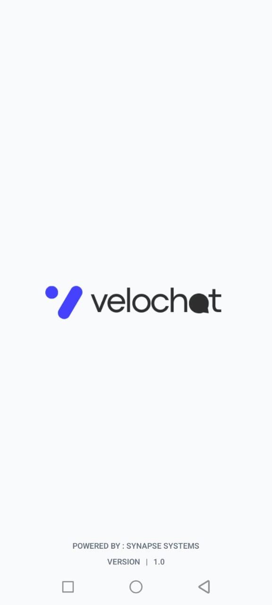
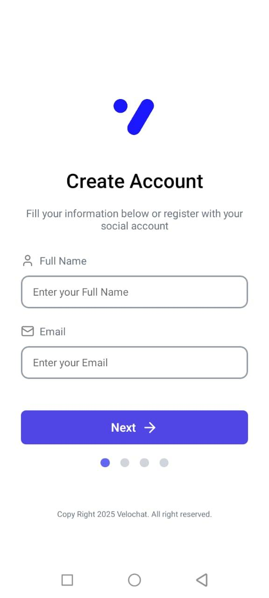
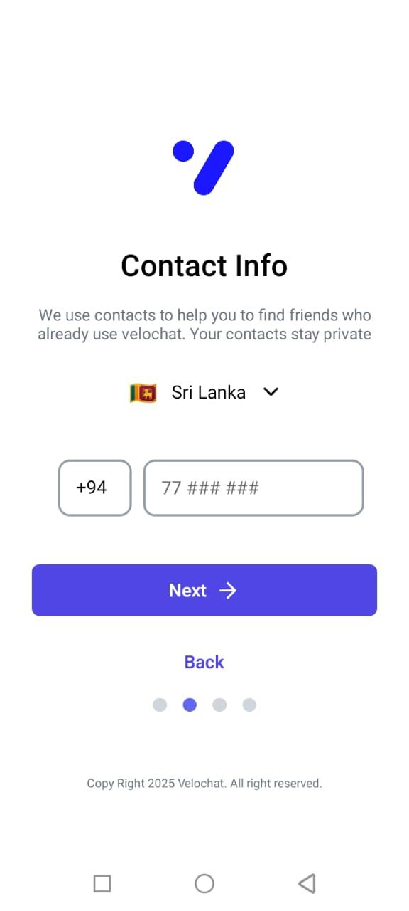
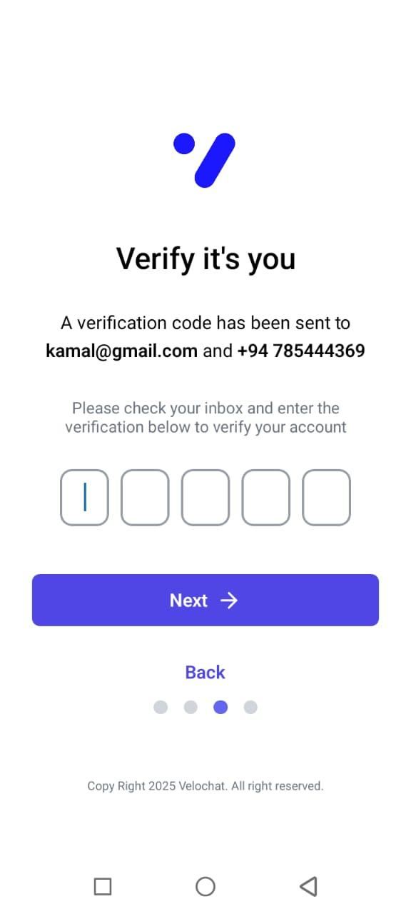
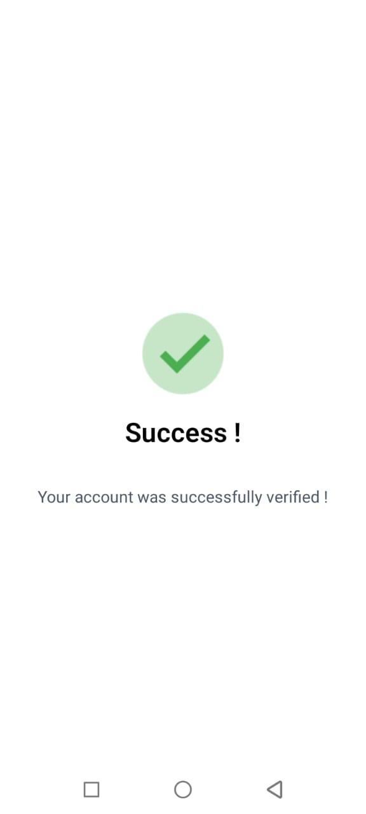
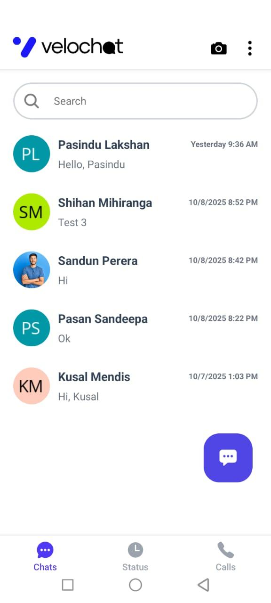
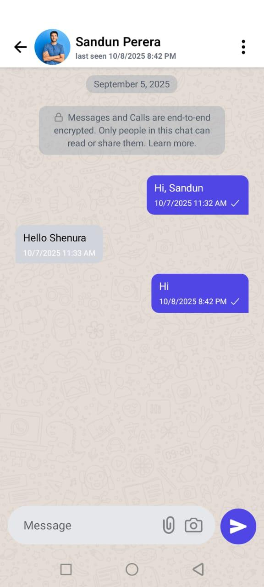
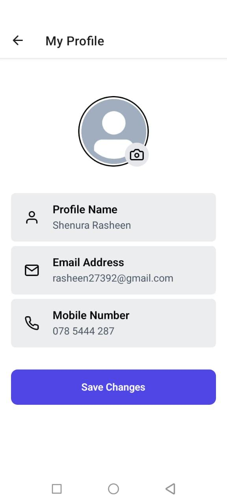
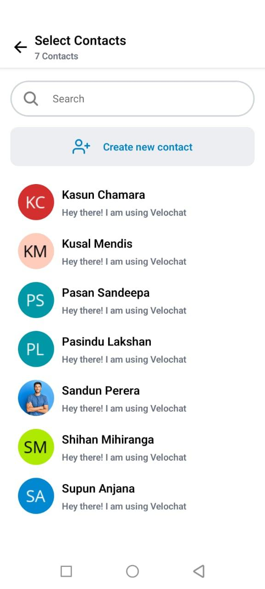
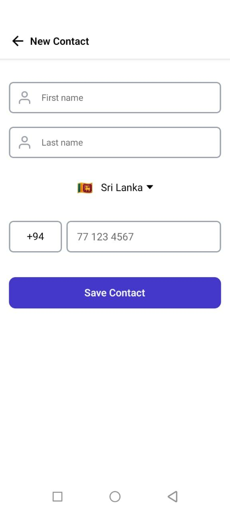

# VeloChat - Real-Time Cross-Platform Messaging App 💬📱

**VeloChat** is a high-performance, real-time mobile messaging application built using React Native (Expo) and a Java backend. Designed for seamless performance and cross-platform compatibility, it enables instant bi-directional messaging, secure authentication, and a clean user experience.

---

## ✨ Key Features & Achievements

- ⚡ **Real-Time Engine**: Instant bi-directional messaging using Java API for WebSocket with low latency.
- 🔐 **Secure Authentication**: Robust sign-up/login flow featuring OTP verification via email and SMS.
- 🧩 **Centralized State**: Built with a global `WebSocketProvider` for scalable communication state management.
- 🎨 **Modern UI Styling**: Styled using **NativeWind** (Tailwind CSS for React Native) for a responsive design.
- 🗄️ **ORM Integration**: Server-side architecture powered by **Hibernate** and **MySQL**.

---

## 🛠️ Tech Stack

### **Frontend (Mobile)**
- **Framework**: React Native with [Expo](https://expo.dev/)
- **Language**: TypeScript
- **Styling**: NativeWind / Tailwind CSS
- **Communication**: WebSocket API

### **Backend**
- **Language**: Java
- **API Framework**: Java Servlets (REST)
- **Real-Time**: Java API for WebSocket
- **ORM**: Hibernate
- **Database**: MySQL
- **Application Server**: GlassFish Server
- **Tunneling**: Ngrok (for development/testing)

---

## 🚀 Getting Started

Follow these instructions to set up and run this frontend project locally.

### **Prerequisites**

- [Node.js](https://nodejs.org/) (v18.x or higher)
- [Expo Go](https://expo.dev/go) app installed on your physical device **OR** an Android Emulator / iOS Simulator

### **1. Install dependencies**

```bash
npm install
```

### **2. Configure environment variables**

Create a `.env` file in the project root and point it to your backend (running separately):

```env
EXPO_PUBLIC_API_URL=http://<YOUR_BACKEND_HOST_OR_NGROK_URL>:8080/velochat/api
EXPO_PUBLIC_WS_URL=ws://<YOUR_BACKEND_HOST_OR_NGROK_URL>:8080/velochat/ws
```

### **3. Run the app**

Start the Expo development server:

```bash
npx expo start
```

- **Physical Device**: Scan the QR code displayed in the terminal using the **Expo Go** app.
- **Android Emulator**: Press `a` in the terminal.
- **iOS Simulator**: Press `i` in the terminal.

**Backend Project** - (https://github.com/shenurarasheen/Velochat-backend.git)

---

## 🖼️ Application Screenshots

<!--
  ADD YOUR SCREENSHOTS HERE.
  Place the image files in a folder (e.g. ./screenshots/) inside the repo root,
  then update the paths below to match your filenames.
-->

| Splash Screen | Signup Screen | Verification | Verification | Success Screen |
| :---: | :---: | :---: | :---: | :---: |
|  |  |  |  |  |

| Home Screen | Chat Screen | Profile Screen | All Contacts Screen | Add Contact Screen |
| :---: | :---: | :---: | :---: | :---: |
|  |  |  |  |  |

<!-- Add more rows/screenshots below as needed, following the same pattern -->

---

## 📜 License

This project is licensed under the [MIT License](LICENSE).
